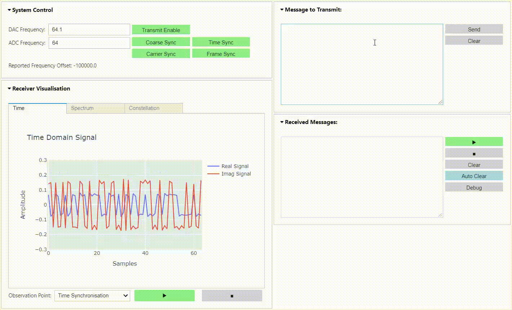

# RFSoC BPSK Transceiver
This repository is only compatible with [PYNQ images v2.6](https://github.com/Xilinx/PYNQ/releases) for the [ZCU111](https://www.xilinx.com/products/boards-and-kits/zcu111.html) and [RFSoC2x2](http://rfsoc-pynq.io/).

## Introduction
This repository contains a BPSK transceiver radio design for RFSoC platforms. The radio is capable of transmitting and receiving BPSK modulated waveforms in loopback, or between RFSoC development boards running the same design. A simple "hello world" example is presented demonstrating that transmitted BPSK waveforms can be received, synchronised, and the payload extracted for analysis. Check out the demonstration below and the quick start guide to install the project on your RFSoC platform.

<p align="center">
  
<p/>

## Quick Start
Follow the instructions below to install the BPSK radio demonstrator on your development board. **You will need to give your board access to the internet**.
* Power on your RFSoC2x2 or ZCU111 development board with an SD Card containing a fresh PYNQ v2.6 image.
* Navigate to Jupyter Labs by opening a browser (preferably Chrome) and connecting to `http://<board_ip_address>:9090/lab`.
* We need to open a terminal in Jupyter Lab. Firstly, open a launcher window as shown in the figure below:

<p align="center">
  
<p/>

* Now open a terminal in Jupyter as illustrated below:

<p align="center">
  
<p/>

* Now simply install the BPSK radio demonstrator through PIP by executing the following command in the terminal:

```sh
pip3 install git+https://github.com/strath-sdr/rfsoc_radio
```

Once installation has complete, you will find the BPSK radio demonstrator notebooks located in the jupyter home workspace in the `bpsk-demonstrator` folder.

## ZCU111 Additional Setup
This repository uses Voila to create simple web applications using Jupyter notebooks. If you would like to use Voila on your ZCU111 development board, simply follow the instructions outlined in this [blog post](https://strath-sdr.github.io/pynq/linux/zynq/fpga/voila/2021/02/22/install-voila-on-pynq-v2-6.html).

## Using the Project Files
The following software is required to use the project files in this repository.
- Vivado Design Suite 2020.1
- System Generator for DSP
- MATLAB R2020a

### System Generator
The Tx and Rx IPs are in separate directories in `rfsoc_radio/boards/ip/sysgen/` that can be opened using the appropriate System Generator dialogue. Due to the large amount of decimation and interpolation in both IPs, simulating the output can take an extraordinarily long time. A less extreme multirate system would simulate much faster! 

### Vivado
This project can be built with Vivado from the command line. Open Vivado 2020.1 and execute the following into the tcl console:

```sh
cd /<repository-location>/boards/<board-name>/rfsoc_radio/
```

Now that we have moved into the correct directory, make the Vivado project by running the make commands below sequentially.

```sh
make project
make block_design
make bitstream_file
```

Alternatively, you can run the entire project build by executing the following into the tcl console:
```sh
make all
```

## License 
[BSD 3-Clause](../../blob/master/LICENSE)
